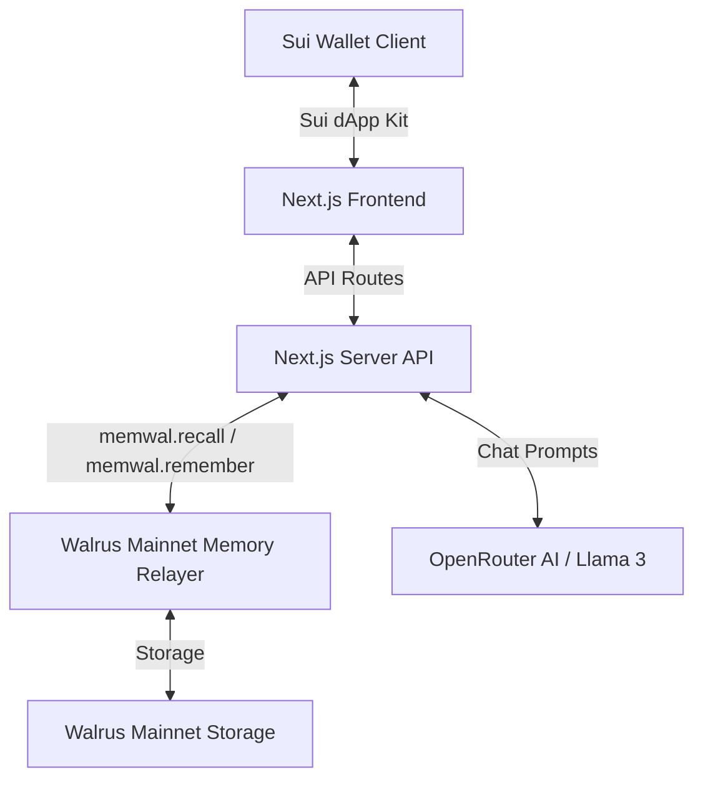

# ⚽️ YellowCard AI — Web3 Betting Copilot & On-Chain Referee

[](https://sui.io)
[](https://walrus.xyz)
[](https://opensource.org/licenses/MIT)

**YellowCard AI** is a professional Web3 betting copilot and real-time referee designed to enforce bankroll discipline and prevent emotional sports betting (loss chasing, over-leveraging, and panic "tilting"). 

Powered by **SIRO**, a personalized AI referee, the platform uses **Walrus Mainnet Memory** to read and write user betting histories on-chain. This provides an immutable ledger of your betting discipline while maintaining a seamless, zero-friction user experience with backend-driven gasless writes.

---

## 🚀 Key Features

*   **SIRO: The AI Betting Referee** 🟨  
    A strict, analytical, and highly personalized AI referee that monitors your betting proposals. SIRO reviews team selections, odds, bet sizing relative to bankrolls, and emotional cues to issue *Yellow Cards* or approve plays.
*   **Decentralized Walrus Mainnet Memory** 🗄️  
    Integrates the official `@mysten-incubation/memwal` SDK on the server-side to recall and remember user betting histories, win rates, and emotional evaluation states on the decentralized Walrus Mainnet.
*   **Frictionless UX (Gasless Writes)** ⚡  
    Unlike traditional Web3 apps that prompt wallet signatures for every transaction, YellowCard AI offloads memory updates to secure backend API routes. This eliminates SUI gas fee popups on every chat message while maintaining on-chain data integrity.
*   **Block-C: The Tilt Ledger** 📊  
    A bold, high-contrast dashboard tracking key metrics:
    *   **Total Bets** and **Win Rate** percentages.
    *   **Loss Streak** counter and **Warning/Yellow Card** tallies.
    *   **Referee Emotional Evaluation Meter** (Stable, Frustrated, Tilting, Blown Bankroll).
    *   Interactive links to on-chain **SuiScan Mainnet** txs and **Walrus Mainnet Aggregator** JSON blobs.
*   **Live Match Drafter** 🏟️  
    Enables users to review fixture lists (e.g., El Clásico, Premier League matchups) and draft selections directly into the AI chat notepad with a single click.

---

## 🛠️ Tech Stack & Architecture



*   **Framework**: Next.js (App Router, Server Actions, and Client Hooks).
*   **Styling**: Vanilla CSS + Tailwind CSS (High-contrast, bold grid aesthetic).
*   **Web3 Integration**: `@mysten/dapp-kit` & `@mysten/sui` (Sui Mainnet).
*   **On-Chain Storage**: `@mysten-incubation/memwal` (Walrus Mainnet).
*   **LLM Integration**: OpenRouter API (`meta-llama/llama-3-70b-instruct`).

---

## 📦 Installation & Local Setup

### 1. Clone the Repository
```bash
git clone https://github.com/sandman-sh/YellowCardAI.git
cd YellowCardAI
```

### 2. Install Dependencies
```bash
npm install
```

### 3. Configure Environment Variables
Create a `.env.local` file in the root directory:
```env
# OpenRouter API Key for SIRO AI
OPENROUTER_API_KEY=your_openrouter_api_key

# Walrus Mainnet Memory (MemWal) Configuration
MEMWAL_PRIVATE_KEY=your_mainnet_delegate_private_key_hex
MEMWAL_ACCOUNT_ID=your_mainnet_memwal_account_object_id
MEMWAL_SERVER_URL=https://relayer.memory.walrus.xyz
```

> [!NOTE]  
> If the Walrus Memory credentials are not provided or remain as placeholders, the server gracefully degrades to an in-memory/simulated database for local development.

### 4. Run the Development Server
```bash
npm run dev
```
Open [http://localhost:3000](http://localhost:3000) in your browser to view the application.

### 5. Build for Production
```bash
npm run build
npm start
```

---

## 🛡️ How SIRO Rules the Pitch

1.  **Play approved (Stable State)**: Proposing small, analytical bets when your win-rate is high and emotions are stable results in a clean VAR review.
2.  **Yellow Card (Frustrated State)**: Proposing a bet immediately after a loss triggers a warning. SIRO advises caution.
3.  **Red Card (Tilting State)**: Trying to double-down or bet a large percentage of your bankroll triggers a tilt alert, freezing betting proposals until you cool down.

---

## 📄 License

This project is licensed under the MIT License. See [LICENSE](LICENSE) for details.
